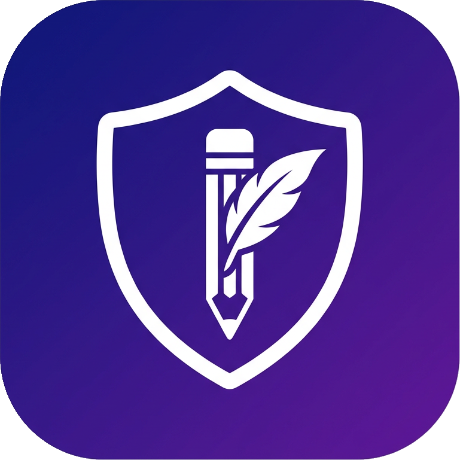

# 🛡 DraftGuard

### Never lose what you type. Ever again.

*Silently backs up everything you type on any website — with per-minute version history, one-click restore, and a built-in Markdown editor. 100% local & private.*

 

 

---

## 😤 The problem

You spend 20 minutes writing the perfect comment, review, or form answer. Then:

- 💥 the page **crashes**
- 🔒 the site **logs you out**
- 🖱 you close the tab **by accident**
- ⬅ you hit **Back** at the wrong moment

...and everything you wrote is **gone forever**. It has happened to everyone. Until now.

## ✨ The solution

DraftGuard sits quietly in the background and **backs up every keystroke** in every text box, on every website — automatically, every 60 seconds, with full version history.

Lost your text? Click the field, hit the **⟲ badge**, and pick the exact minute you want back. Done.

---

## 🚀 Features

|     | Feature | Free | Premium 👑 |
|-----|---------|:----:|:-------:|
| 💾 | Auto-save every 60 seconds, on every site | ✅ | ✅ |
| ⟲ | One-click restore of any version | ✅ | ✅ |
| ⌨ | **Quick Paste Menu** — `Ctrl+Shift+Y` overlay with your last drafts | ✅ | ✅ |
| 🖱 | Right-click → *Paste Latest Draft* | ✅ | ✅ |
| 🔢 | Live word & character counter | ✅ | ✅ |
| 📝 | Built-in offline Markdown editor with live preview | ✅ | ✅ |
| ⏱ | How long your drafts are kept | 1 hour | **30 days** |
| ⏳ | **Time Machine slider** — scrub back to yesterday or last week | 🔒 | ✅ |
| 👻 | **Ghost-Writer overlay** — on-page version timeline, zero popup | 🔒 | ✅ |
| 🔐 | **Vault** — pin drafts forever, protected by a PIN code | 🔒 | ✅ |
| ⚡ | **Instant export** → Google Docs, Notion, Obsidian, `.md` | 🔒 | ✅ |
| 🔍 | Advanced filters — RegEx, sort by length, site & date | 🔒 | ✅ |

### 💎 Premium: **$5.99/month** or **$49/year** *(save 32%)*

---

## 🔒 Privacy-first by design

DraftGuard is built on one rule: **your words never leave your device.**

- ✅ Everything is stored in Chrome's local storage — **zero cloud, zero servers, zero network calls**
- ✅ **No account. No tracking. No analytics.**
- ✅ Password, credit-card, CVV, OTP, PIN and IBAN fields are **never captured** — by design
- ✅ Minimal permissions: `storage`, `alarms`, `activeTab`, `contextMenus` — that's it

> 🔏 **Closed source:** DraftGuard's source code is proprietary. This repository hosts the official website, documentation, and release notes.

---

## 📦 Installation

**Chrome Web Store** — *coming soon!* Hit ⭐ **Watch** on this repo to get notified.

Until then, grab the latest release from the [Releases page](https://github.com/talaurlove/draftguard/releases) and load it via `chrome://extensions` → Developer mode → *Load unpacked*.

---

## 🎯 Who is it for?

| | |
|---|---|
| ✍️ **Writers & bloggers** | Draft safely in any CMS — WordPress, Medium, Ghost |
| 🎓 **Students** | Never re-type an essay into a portal that timed out |
| 💻 **Developers** | GitHub issues, PR reviews, Stack Overflow answers — all protected |
| 🎧 **Support agents** | Ticket replies survive every crash and logout |
| 🌍 **Everyone** | Because losing a long comment hurts, every single time |

---

## 🗺 Roadmap

- [x] Per-minute version history
- [x] Quick Paste Menu (global shortcut)
- [x] Ghost-Writer on-page timeline
- [x] Vault with PIN lock
- [x] Instant export (Docs / Notion / Obsidian / Markdown)
- [ ] Chrome Web Store launch 🚀
- [ ] Cross-device sync (Premium)
- [ ] Firefox & Edge versions
- [ ] Team licenses

---

## 💬 Support & feedback

- 🐛 Found a bug? [Open an issue](https://github.com/talaurlove/draftguard/issues)
- 💡 Feature idea? [Start a discussion](https://github.com/talaurlove/draftguard/discussions)
- 📧 Business inquiries: **talaurlove@gmail.com**

---

**© 2026 DraftGuard — All rights reserved.**

*DraftGuard is proprietary software. The name, logo, and code may not be copied, modified, or redistributed without written permission.*

Made with 💜 · [Website](https://talaurlove.github.io/draftguard/) · [Privacy](#-privacy-first-by-design)

